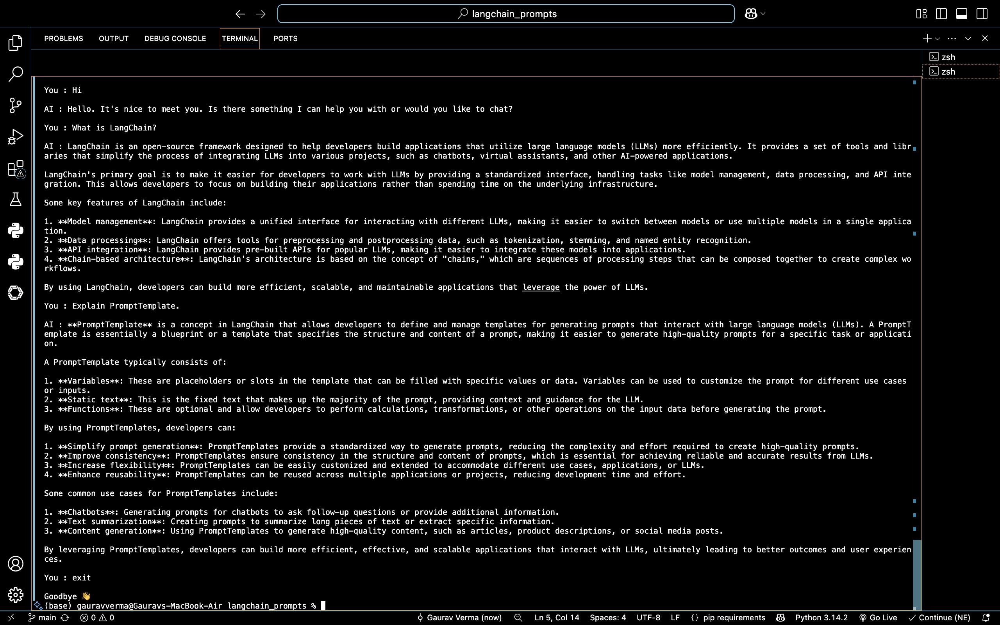

# 🤖 LangChain Chatbot v1

A conversational AI chatbot built using **LangChain** and the **Groq API**. The chatbot maintains conversation context using LangChain's prompt templates and message history, enabling smooth multi-turn conversations.


---

## ✨ Features

- 💬 **Multi-turn Conversations** – Maintains context across multiple user interactions.
- 🧠 **Conversation Memory** – Stores previous messages using LangChain's chat history.
- ⚡ **Fast Responses** – Powered by Groq's high-speed LLM inference.
- 📝 **Prompt Engineering** – Uses `ChatPromptTemplate` and `MessagesPlaceholder`.
- 🔐 **Secure API Key Management** – Keeps API keys safe using `.env`.
- 🚪 **Exit Command Support** – End the chatbot anytime using `exit` or `quit`.

---

## 🛠️ Tech Stack

- **Language:** Python
- **Framework:** LangChain
- **LLM Provider:** Groq API
- **Environment Variables:** python-dotenv

---

## 🧩 Key Concepts Used

- Prompt Engineering
- ChatPromptTemplate
- MessagesPlaceholder
- ChatMessageHistory
- Conversation Memory
- Environment Variables
- LLM Integration

---

## 📋 Requirements

- Python 3.10+
- Groq API Key
- Internet Connection

---

## 📂 Project Structure

```text
.
├── chatbot.py
├── requirements.txt
├── .env.example
├── images/
│   └── demo.png
├── README.md
└── .gitignore
```

---

## 🚀 Installation & Setup

### 1️⃣ Clone the repository

```bash
git clone https://github.com/Gaurav4421/langchain-chatbot-v1.git
cd langchain-chatbot-v1
```

### 2️⃣ Install dependencies

```bash
pip install -r requirements.txt
```

### 3️⃣ Create a `.env` file

Copy the example file:

```bash
cp .env.example .env
```

Then add your Groq API key:

```text
GROQ_API_KEY=your_groq_api_key_here
```

### 4️⃣ Run the chatbot

```bash
python chatbot.py
```

---

## 🎮 Usage

Start chatting directly from your terminal.

Example:

```text
You : What is LangChain?

AI : LangChain is an open-source framework for building
applications powered by Large Language Models...
```

Type **exit** or **quit** anytime to close the chatbot.

---

## 📸 Demo



---

## 📚 What I Learned

While building this project, I learned:

- Building conversational AI applications using LangChain.
- Designing reusable prompts with ChatPromptTemplate.
- Managing conversation history using MessagesPlaceholder and ChatMessageHistory.
- Integrating Groq API for fast LLM inference.
- Managing API keys securely with `.env`.
- Creating executable LangChain pipelines.
- Organizing and documenting a GitHub project professionally.

---

## 🔮 Future Improvements

- 🌐 Streamlit Web Interface
- 📄 PDF Chatbot using RAG
- 🎙️ Voice Assistant Support
- 🤖 Multiple LLM Support (Groq, OpenAI, Ollama)
- 🧠 Long-Term Conversation Memory
- 🔗 LangGraph Multi-Agent Workflow

---

## 👨‍💻 Author

**Gaurav Verma**

B.Tech Student | Aspiring AI Engineer

Currently learning:

- 🤖 Transformers
- 🔗 LangChain
- 📚 Retrieval-Augmented Generation (RAG)
- 🧠 AI Agents

---

## ⭐ Support

If you found this project useful, consider giving it a ⭐ on GitHub.